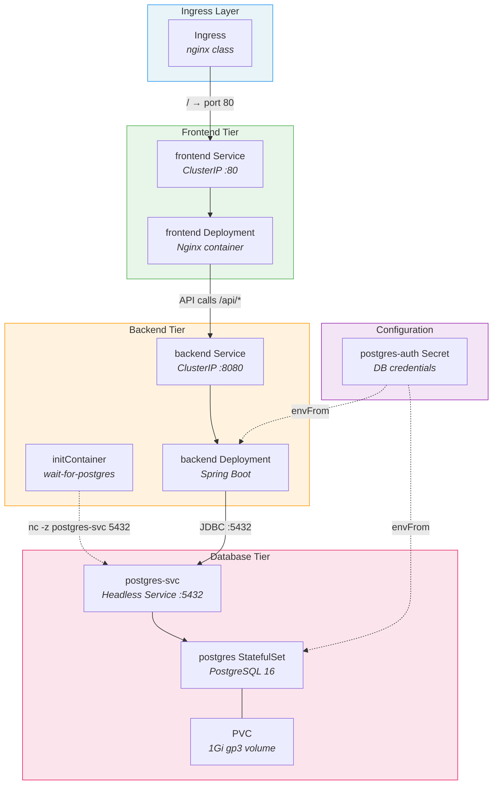
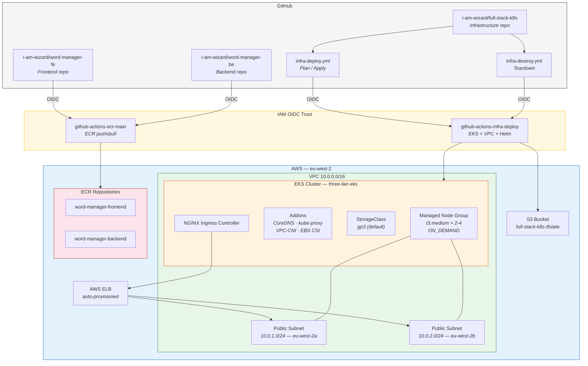
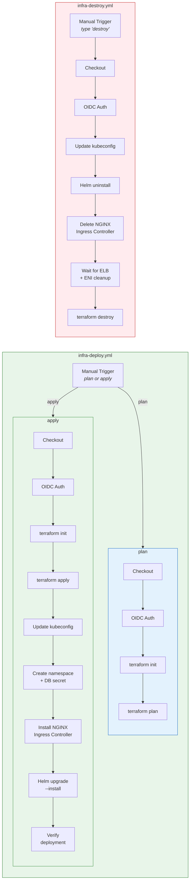

# My Kubernetes Learning Journey

> A chronological walkthrough of building a production-grade three-tier application on Kubernetes — from a local `kind` cluster to a fully automated AWS EKS deployment with Terraform and GitHub Actions.

---

## Learning Timeline

```mermaid
timeline
    title From Local Cluster to Production EKS
    section Phase 1 — Local Dev
        kind cluster setup          : Created a 4-node kind cluster (1 control-plane, 3 workers)
        Helm chart authoring        : Built a reusable Helm chart for the 3-tier app
        Init containers             : Added initContainer to wait for Postgres before backend starts
        k3s on Raspberry Pi         : Experimented with resource tuning on bare-metal ARM nodes
    section Phase 2 — AWS Infra
        Terraform for EKS           : Provisioned a managed EKS cluster with VPC and node groups
        ECR repositories            : Created private container registries for frontend and backend
        GitHub OIDC                 : Replaced long-lived AWS keys with short-lived OIDC tokens
        DRY refactoring             : Consolidated duplicate IAM/OIDC code and restructured files
    section Phase 3 — Stateful Storage
        StatefulSet for Postgres    : Migrated Postgres from Deployment to StatefulSet with PVCs
        EBS CSI Driver              : Installed the EBS CSI addon for dynamic gp3 volume provisioning
        Storage classes             : Created a default gp3 StorageClass for the cluster
    section Phase 4 — Networking
        Ingress resource            : Replaced NodePort/LoadBalancer with a proper Ingress resource
        NGINX Ingress Controller    : Deployed the NGINX Ingress Controller with AWS ELB integration
        VPC subnet tagging          : Tagged public subnets for automatic ELB discovery by Kubernetes
    section Phase 5 — CI/CD
        Deploy workflow             : Built a GitHub Actions workflow for plan/apply with Helm deploy
        Destroy workflow            : Built a safe teardown workflow with ELB/ENI cleanup guards
        IAM hardening               : Scoped down IAM permissions for the infra deploy role
```



---

## Git Flow

The project evolved through feature branches and pull requests. Here is the branching history:

```mermaid
gitgraph
    commit id: "6d2066c" tag: "initContainers"
    commit id: "b406a1f" tag: "image builds"
    commit id: "ff5e5bf" tag: "README fix"
    commit id: "371f642" tag: "k3s resources"
    commit id: "0e7a5be" tag: "EKS Terraform"
    commit id: "81fd79b" tag: "ECR + OIDC"
    commit id: "a284014" tag: "DRY OIDC"
    commit id: "82d10c8" tag: "restructure"
    branch feature/add-storage-class
    commit id: "a4c56b0" tag: "StatefulSet"
    checkout main
    merge feature/add-storage-class id: "10983d1" tag: "PR #1"
    branch feature/change-vpc-file
    commit id: "ad1226b" tag: "Ingress"
    checkout main
    commit id: "cd81bab" tag: "Ingress merge"
    commit id: "3b19305" tag: "teardown docs"
    branch feature/github-action-infra
    commit id: "fdf9c88" tag: "GH Actions"
    checkout main
    merge feature/github-action-infra id: "f58aa0a" tag: "PR #2"
    commit id: "cac8bb3" tag: "IAM cleanup"
    commit id: "490ac75" tag: "HEAD"
```

---

## Phase 1 — Local Development with kind

The journey started with getting a three-tier application running locally. I set up a 4-node `kind` cluster (1 control-plane + 3 workers), wrote a Helm chart from scratch, and figured out how to wire frontend, backend, and Postgres together using Kubernetes Services. One of the first real challenges was the startup ordering problem — the Spring Boot backend would crash if Postgres wasn't ready yet. Adding an `initContainer` with a simple `nc` (netcat) check solved that elegantly. I also briefly experimented with deploying to a k3s cluster on a Raspberry Pi, which taught me about resource constraints on low-powered hardware.

**Key commits:** `6d2066c` → `371f642`

---

## Phase 2 — AWS Infrastructure with Terraform

Moving from local to cloud meant learning Terraform. I provisioned an EKS cluster using the `terraform-aws-modules/eks/aws` module, set up a VPC with public subnets across two availability zones, and created ECR repositories for the container images. Instead of storing AWS access keys as GitHub Secrets, I learned to use GitHub's OIDC provider to assume IAM roles with short-lived credentials — a much more secure approach. As the Terraform codebase grew, I refactored it for DRY principles and restructured files into logical directories (`infra/eks/`, `infra/ecr-oidc/`, `infra/eks-oidc/`).

**Key commits:** `0e7a5be` → `82d10c8`

---

## Phase 3 — Stateful Storage

Postgres doesn't belong in a stateless Deployment. I learned this the hard way and migrated it to a StatefulSet with `volumeClaimTemplates` for persistent storage. On AWS, this required the EBS CSI Driver addon and a custom `gp3` StorageClass set as the cluster default. The StatefulSet guarantees stable network identity (`postgres-0`) and persistent volume binding, so data survives pod restarts and rescheduling.

**Key commits:** `a4c56b0` (branch: `feature/add-storage-class`, merged via PR #1)

---

## Phase 4 — Networking with Ingress

Initially, the frontend was exposed via a `NodePort` service. That's fine for local development but not for production. I replaced it with a Kubernetes Ingress resource backed by the NGINX Ingress Controller. On AWS, the Ingress Controller automatically provisions an Elastic Load Balancer. For this to work, the VPC public subnets needed the `kubernetes.io/role/elb: "1"` tag so the controller could discover them. I also cleaned up the old k3s-specific chart values and documented the full teardown process (delete Helm release → delete Ingress Controller → Terraform destroy) to avoid orphaned AWS resources.

**Key commits:** `cd81bab` → `3b19305` (branch: `feature/change-vpc-file`)

---

## Phase 5 — CI/CD with GitHub Actions

The final phase automated everything. I built two GitHub Actions workflows — one for deploying (`infra-deploy.yml`) and one for tearing down (`infra-destroy.yml`). Both use OIDC to authenticate with AWS, eliminating the need for long-lived credentials. The deploy workflow supports two modes: `plan` (preview changes) and `apply` (provision infra + deploy the Helm chart). The destroy workflow includes safety guards — it waits for ELB and ENI cleanup before running `terraform destroy` to avoid dependency errors. After the initial implementation, I hardened the IAM permissions to follow least-privilege principles.

**Key commits:** `fdf9c88` → `cac8bb3` (branch: `feature/github-action-infra`, merged via PR #2)

---

## Application Architecture



---

## AWS Infrastructure



---

## CI/CD Pipeline



---

## Tech Stack Summary

| Layer | Technology | Purpose |
|-------|-----------|---------|
| **Frontend** | Nginx (container) | Static file serving + reverse proxy |
| **Backend** | Spring Boot (Java) | REST API |
| **Database** | PostgreSQL 16 | Persistent data store |
| **Orchestration** | Kubernetes (kind / EKS) | Container orchestration |
| **Packaging** | Helm | Kubernetes manifest templating |
| **Infrastructure** | Terraform | VPC, EKS, ECR, IAM provisioning |
| **CI/CD** | GitHub Actions | Automated deploy and teardown |
| **Auth** | GitHub OIDC → AWS IAM | Keyless cloud authentication |
| **Registry** | AWS ECR + GitHub GHCR | Container image storage |
| **Storage** | AWS EBS (gp3) | Persistent volumes for Postgres |
| **Networking** | NGINX Ingress Controller + AWS ELB | External traffic routing |
| **State** | S3 (versioned, encrypted) | Terraform remote state |
